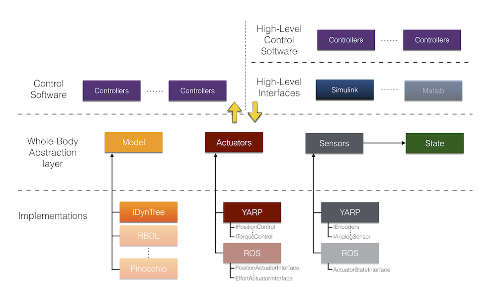

## Whole-Body Interface
---
####YARP-based implementation
##### a.k.a. `yarpWholeBodyInterface`

#VSLIDE

### What is the Whole-Body Interface?

- Whole-Body Interface is a software abstraction library.
- `yarpWholeBodyInterface` is an implementation of the Whole-Body Interface for YARP-based robot
- It allows to control and interact with a robot independently of the robot middleware/software libraries implementation

#VSLIDE

### Dynamical model of a
### free-floating mechanical system

$$ M(q) \dot{\nu} + C(q, \nu) \nu + g(q) + J^\top(q) f = S \tau $$

---

- $q \in SE(3) \times \mathbb{R}^n,~\nu \in \mathfrak{se}(3) \times \mathbb{R}^n $
- $ M(q) \in \mathbb{R}^{(n + 6) \times (n + 6)} $ is the mass matrix
- $ C(q, \nu) \in \mathbb{R}^{(n + 6) \times (n + 6)} $ is the Coriolis, and nonlinear effects matrix
- $ g(q) \in \mathbb{R}^{n + 6} $ is the gravitational effect bias vector

#VSLIDE

### Dynamical model of a
### free-floating mechanical system

$$ M(q) \dot{\nu} + C(q, \nu) \nu + g(q) + J^\top(q) f = S \tau $$

---

- $\tau \in \mathbb{R}^m$ are the actuation torques
- $ J(q) \in \mathbb{R}^{k \times (n + 6)} $ is the contact Jacobian
- $ f \in \mathbb{R}^k $ are the contact forces and torques
- $ S \in \mathbb{R}^{(n + 6) \times m} $ denotes the underactuation pattern

#VSLIDE

### Control robot in YARP

- YARP associate a controlboard to each robot part  (e.g. arm, leg, torso)

```cpp
IEncoders *leftArmEncoders;
ITorqueControl * leftArmController;
//Do the same for all the other parts
//Read state
leftArmEncoders->getEncoders(leftArmConfiguration);
leftArmEncoders->getEncoderSpeeds(leftArmVelocity);
//Do the same for all the other parts
//Compute control. Build mass matrix, etc
leftArmController->setRefTorques(torques);
//Do the same for all the other parts
```

#VSLIDE

### Control robot in ROS

- As in YARP, but using `ros_control`


#VSLIDE
### Why Whole-Body Interface

- Functions are thought with the mathematical model in mind
     - $q := $  world/base homogenous transformation $+$ vector of joints angles vs. manages and coordinates different controlboards
- Controller code is clean: focus on the control algorithm not in the implementation details


#HSLIDE

### Whole-Body Interface Architecture



#VSLIDE

### Interface components

- Model: kinematic and dynamic model
- Actuators: send references to robot low level controllers
- Sensors: read from robot sensors
- State: obtain information from the robot, either directly from sensors or though estimation

#HSLIDE


### Whole-Body Interface: configuration

- Expected pre-defined key-value pairs
    - `urdf`: points to the `URDF` model file
    - `robot`: prefix of the YARP ports for the robot
    - ...

#VSLIDE

### Example Code

```c++
Property wbiProperties;
//retrieve the joint list
std::string wbiList = "joint_list_name"

wbi::IDList iCubMainJoints;
yarpWbi::loadIdListFromConfig(wbiList, 
                              wbiProperties, 
                              iCubMainJoints);
robot = new yarpWbi::yarpWholeBodyInterface("computed_torque", 
                                            wbiProperties);
robot->addJoints(iCubMainJoints);
robot->init()

```

#VSLIDE

### Whole-Body Interface: use

- Functions take *generic* data types (e.g. `double *` for vectors)
- Dimensions are usually equal to the number of degrees of freedom (plus $6$, i.e. the size of the base)

#VSLIDE

### Example Code

```c++
//Read information of the robot
robot.getEstimates(wbi::ESTIMATE_JOINT_POS, jointPositions);

//compute kinematic information
robot.forwardKinematics(jointPositions, world2BaseFrame, 
                        centerOfMassLinkID, transformation);

//compute dynamic information
robot.computeMassMatrix(jointPositions.data(), 
                        world2BaseFrame, massMatrix);
```
